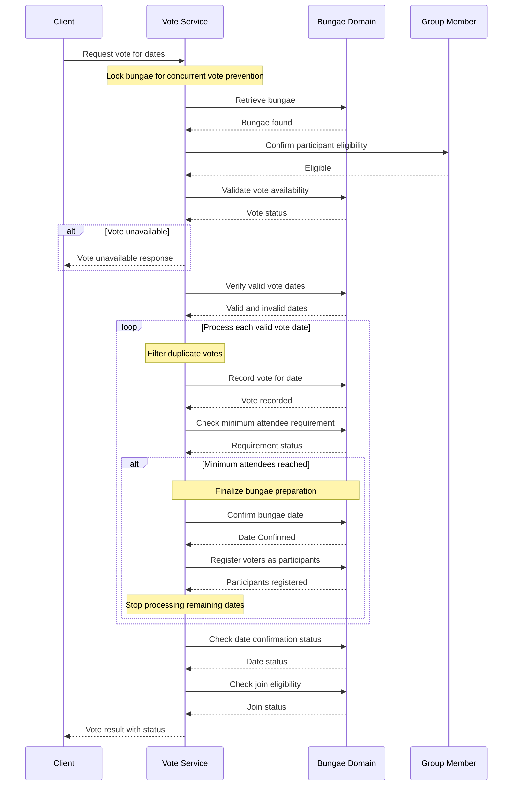

# 번개 날짜 투표 API 시퀀스 다이어그램

## 개요
번개 날짜 투표 서비스(`voteBungaeDates`)의 비즈니스 로직 흐름을 도메인 중심으로 표현한 시퀀스 다이어그램입니다.

## 시퀀스 다이어그램

## 주요 비즈니스 흐름

### 1. Lock bungae for concurrent vote prevention (동시성 제어)
- 동일 번개에 대한 동시 투표를 방지하기 위해 번개를 잠금
- 최대 3회까지 락 획득 재시도
- 락 획득 실패 시 동시성 충돌 예외 발생

### 2. Retrieve bungae & Confirm participant eligibility (번개 조회 및 참여 자격 확인)
- 투표 대상 번개를 조회
- 요청한 멤버가 번개가 속한 그룹의 멤버인지 확인
- 참여 자격이 없으면 예외 발생

### 3. Validate vote availability (투표 가능 여부 검증)
- 번개의 현재 상태가 투표 가능한 상태(`DATE_VOTING`)인지 확인
- 투표 불가능 상태이면 `wasVotable=false`로 즉시 응답 반환

### 4. Verify valid vote dates & Filter duplicate votes (유효 날짜 검증 및 중복 투표 필터링)
- 요청된 투표 날짜가 번개의 날짜 후보에 존재하는지 확인
- 이미 투표한 날짜는 중복 투표로 판단하여 제외
- 존재하지 않는 날짜와 중복 투표는 실패 목록에 추가

### 5. Record vote for date (날짜별 투표 기록)
- 각 유효한 날짜에 대해 투표를 기록
- 투표가 성공적으로 기록되면 해당 날짜의 투표 수 증가

### 6. Check minimum attendee requirement (최소 인원 요건 확인)
- 투표 후 해당 날짜의 투표 수가 최소 인원에 도달했는지 확인
- 최소 인원-1에 도달하면 다음 투표로 최소 인원이 충족됨

### 7. Lock bungae date & Register voters as participants (번개 날짜 확정 및 참여자 등록)
- **날짜 확정**: 최소 인원 달성 시 번개 날짜를 확정하고 상태를 `RECRUITING`으로 변경
- **참여자 자동 등록**: 해당 날짜에 투표한 모든 사용자를 참여자로 등록
- 날짜가 확정되면 남은 투표 날짜 처리를 중단

### 8. Check status & Return vote result (상태 확인 및 투표 결과 반환)
- 날짜 확정 여부 확인
- 참여 가능 여부 확인
- 현재 번개 상태 및 실패한 투표 날짜 목록과 함께 응답 반환

## 도메인 비즈니스 규칙

### 투표 가능 여부 (Vote Availability)
- 번개가 `DATE_VOTING` 상태일 때만 투표 가능
- 다른 상태에서는 투표 불가

### 최소 인원 요건 (Minimum Attendee Requirement)
- 투표 수가 최소 인원에 도달하면 날짜 자동 확정
- 최소 인원 달성은 투표 수 = 최소 인원으로 판단

### 날짜 확정 (Date Confirmation)
- 최소 인원이 충족되면 번개 날짜를 확정
- 확정 시 번개 상태가 `DATE_VOTING`에서 `RECRUITING`으로 전환
- 해당 날짜에 투표한 모든 사용자가 자동으로 참여자로 등록

### 참여 자격 (Participant Eligibility)
- 투표하려는 멤버는 번개가 속한 그룹의 멤버여야 함
- 그룹 멤버가 아니면 투표 불가

### 중복 투표 방지 (Duplicate Vote Prevention)
- 동일한 날짜에 대해 한 번만 투표 가능
- 이미 투표한 날짜에 재투표 시도 시 실패 목록에 추가

## 동시성 제어 상세
- Named Lock: 논리적 키(`bungae:{bungaeId}`)를 기반으로 락 획득
  - 다른 번개에 대한 투표는 병렬 처리 가능
  - 동일 번개에 대한 동시 투표만 직렬화

### 재시도 전략
- 최대 3회 재시도
- 락 획득 실패 시 사용자에게 명확한 에러 메시지 전달

## TODO (향후 개선사항)
- [ ] 채팅방 자동 생성 (최소 인원 달성 시)
- [ ] 푸쉬 알림 전송 (투표자들에게 날짜 확정 알림)
- [ ] 투표 마감 시간 자동 처리 스케줄러

